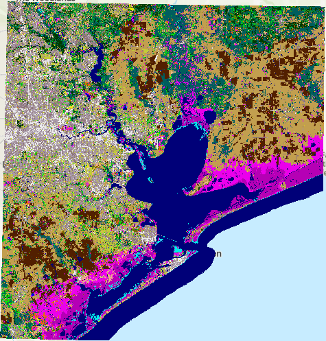
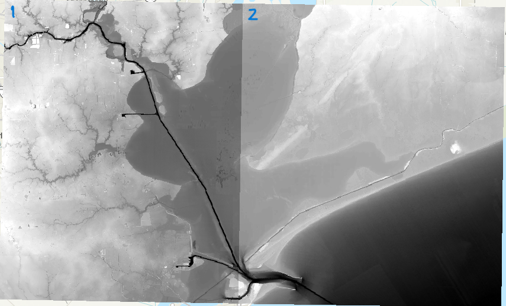

The goal of this example is to get acquainted with ADCIRC-Subgrid. The runs 
stitch higher resolution information/ lookup tables from two different TIF files.

This folder contains 2 raster elevation files and 1 raster landcover file,
and was created to run the subgrid preprocessor code over multiple datasets.

Here is a step-by-step guide to running the example.

# Step 0: Download data from git-lfs
You will need to download the data from git-lfs before running the code.

```commandline
git lfs fetch
git lfs pull
git lfs checkout
gunzip fort.14.gz
```

Alternatively, you can clone the data from GitHub from your local desktop command line.
You have to have GitHub installed on your desktop from the [site for Windows](https://git-scm.com/downloads/win)

```bash
git clone https://github.com/waterinstitute/adcirc-subgrid.git
```
For the first time, you would have to input your git user id and password.

There should be 3 TIF files:
0. 2021_CCAP_J1139301_4326.tif 
  This is a land use map from the 2021 Community Climate Action Plan (CCAP) near Houston, Texas.
  This file is in Geographic Co-ordinates WGS 1984 (EPSG:4326), which, when projected, would have a cell size of ~30m. 
  The file will be used in both runs.

Fig 1: 2021 CCAP land use map of Houston, Texas
1. galveston_13_mhw_20072.TIF:
  Digital elevation model (DEM) for one section of the Houston, Texas region. It's also in WGS 1984 with 1/9th Arc resolution.

3. galveston_13_mhw_20072.TIF:
  Digital elevation model for second section of the Houston, Texas region. It's also in WGS 1984 with 1/9th Arc resolution. 

Fig 2: The 1/9th Arc resolution DEM 1 and 2  


# Step 1: Run Preprocessor Pass 1

Run subgrid preprocessor with `input.yaml` as input. This will use one of the
dem files, landcover file, and mesh file to build a subgrid lookup table.

# Step 2: Run Preprocessor Pass 2

Run subgrid preprocessor with `input_update_existing.yaml`. The updated yaml
contains an extra optional input line called "existing subgrid" where you
add the filepath of the existing subgrid. Running the preprocessor code again
will use the second dem file, landcover file, and mesh file to build and
updated lookup table with subgrid values for the first and second dem included.

## NOTE
  - The code will not overwrite the existing subgrid data, so use the highest priority datasets first.
  - It is recommended that you use a different name for the updated subgrid table to keep track of everything.
